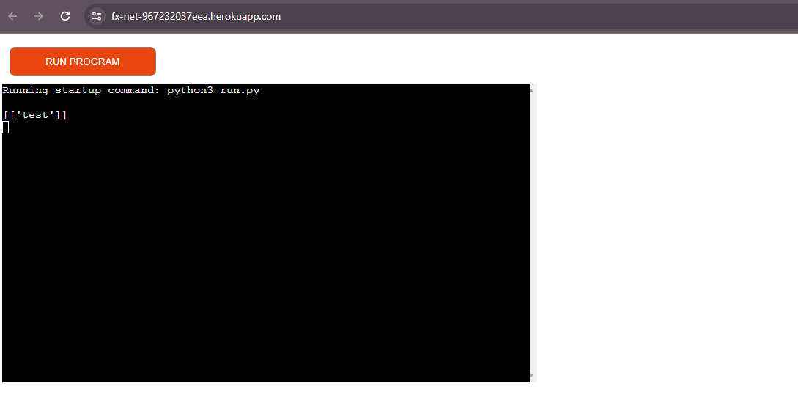

# TESTING.md file

This file will house any development testing performed and final testing performed.

## Deployment to Heroku

Evidence of first initial deployment to Heroku, proof of connection to googlesheets, by printing out contents of the connected sheet. With proof that it is displayed on the web terminal on Heroku. 

## TESTING EMPTY DATABASE

These tests are to check that the user is correctly prompted and informed that there is no data in the database to run the required actions. 

### Set up

I cleared out the `fx_net_db` database (workbook) of any information on the relevant tables (worksheet), those being `FILES_LOADED` and `TRADES`.

### TESTS PERFORMED

| Test ID | Description | Outcome | Comments | Evidence |
|--------|-------------|---------|----------|----------|
| test1 | Test Netting Summary by Value Date menu option informs the user that there is no data available | Passed | Noticed the UI was not clearing like the other tests. Corrected by creating a new function to (`no_data_message`) control the action of displaing a message when there is no data and applied to all related other functions |  |
| test2 | Test Create Netting Report by Value Date menu option informs the user that there is no data available | Passed ||  |
| test3 | Test Create payment files menu option informs the user that there is no data available | Passed ||  |
| test4 | Test Trade count by Client - All Trade Dates menu option informs the user that there is no data available | Passed ||  |
| test5 | Test Trade count by Client - Trade Date Selector menu option informs the user that there is no data available | Passed ||  |
| test6 | Test Trade count by Client and Client Trader menu option informs the user that there is no data available | Passed | Was not clearing initially, refactored to include the newly created `no_data_message` function |  |
| test7 | Test Trade count by Bank Trader menu option informs the user that there is no data available | Passed | Was not clearing initially, refactored to include the newly created `no_data_message` function |  |

## TESTING TABLES UPDATE CORRECTLY

These tests are to check the relevant tables in either `trading_simulator_db` and `fx_net_db` are updated correctly based on the options the users select in the console. 

| Test ID | Description | Outcome | Comments | Evidence |
|--------|-------------|---------|----------|----------|
| test8 | Test the `TRADING_APP_DATE` is updated by one business day after generating the trade data file (weekday to weekday) | Passed |  |  |
| test9 | Test the `TRADING_APP_DATE` is updated by one business day after generating the trade data file (over weekend test) | Passed | It should not generate a trade date of a Saturday or Sunday (which it does not) |  |
| test10 | Test the `FILES_LOADED` table is updated. Recording the files already uploaded into the `TRADES` table. This ensures that the user doesn't have the option to load duplicate files into the `TRADES` table | Passed | This test also demonstrates the fuzzy search selection of files and shows a prompt to the user when no files are available for loading |  |
| test11 | Test the `TRADES` table is updated. | Passed | See test10 for full details on functionality |  |

## TESTING CALCULATIONS

The below evidences the calculations performed are correct for both the spreadsheet and the console part of the program. 

See [Netting Evidence Excel File](/testing/data/netting-evidence.xlsx) with calculation evidence. Needs to be opened in a spreadsheet application (Googlesheet/Excel etc)

## TESTING FILES SEND EMAIL AND CAN OPEN

Tested with an email address not associated with the developer (Wife) who was able to open the links

## TESTING FULL DEMONSTRATION OF WORKFLOW OF THE APP

## BROWSER TESTS

This was checked on Chrome and Firefox with no issues.
But informed by my mentor that it did not work within Safari.

## PEP8 Validation

| Test ID | Description | Outcome | Comments | Evidence |
|--------|-------------|---------|----------|----------|
|test12|PEP8 Check on email.py|Passed|||
|test13|PEP8 Check on utils.py|Passed|||
|test14|PEP8 Check on database.py|Passed|||
|test15|PEP8 Check on trading_simulator.py|Passed|||
|test16|PEP8 Check on fx_net.py|Passed|1 line was 1 char too long, but left for readability||
|test17|PEP8 Check on app_selector.py|Passed|||
|test18|PEP8 Check on run.py|Passed|||
|test19|PEP8 Check on helper.py|Passed|||

## FINAL DEPOLYMENT

| Test ID | Description | Outcome | Comments | Evidence |
|--------|-------------|---------|----------|----------|
|test20|Final Deployment Evidence|Passed|||

