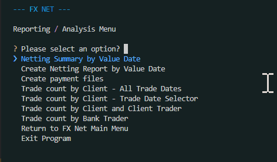
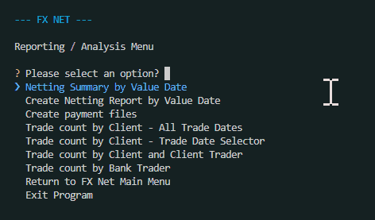

# TESTING.md file

This file will house any development testing performed and final testing performed.

## Deployment to Heroku

Evidence of first initial deployment to Heroku, proof of connection to googlesheets, by printing out contents of the connected sheet. With proof that it is displayed on the web terminal on Heroku. 

# Tests to check when complete

Check everything runs with data in the FX Net database and without it. 

## TESTING EMPTY DATABASE

These tests are to check that the user is correctly prompted and informed that there is no data in the database to run the required actions. 

### Set up

I cleared out the `fx_net_db` database (workbook) of any information on the relevant tables (worksheet), those being `FILES_LOADED` and `TRADES`.

### TESTS PERFORMED

| Test ID | Description | Outcome | Comments | Evidence |
|--------|-------------|---------|----------|----------|
| test1 | Test Netting Summary by Value Date menu option informs the user that there is no data available | Passed | Noticed the UI was not clearing like the other tests. Corrected by creating a new function to (`no_data_message`) control the action of displaing a message when there is no data and applied to all related other functions |  |
| test2 | Test Netting Summary by Value Date menu option informs the user that there is no data available | Passed ||  |
| test3 | Test Netting Summary by Value Date menu option informs the user that there is no data available | Passed ||  |
| test4 | Test Netting Summary by Value Date menu option informs the user that there is no data available | Passed ||  |
| test5 | Test Netting Summary by Value Date menu option informs the user that there is no data available | Passed ||  |
| test6 | Test Netting Summary by Value Date menu option informs the user that there is no data available | Passed | Was not clearing initially, refactored to include the newly created `no_data_message` function |  |
| test7 | Test Netting Summary by Value Date menu option informs the user that there is no data available | Passed | Was not clearing initially, refactored to include the newly created `no_data_message` function |  |

## TESTING TABLES UPDATE CORRECTLY

system date
files loaded
trades

## TESTING FILES GENERATE CORRECTLY

